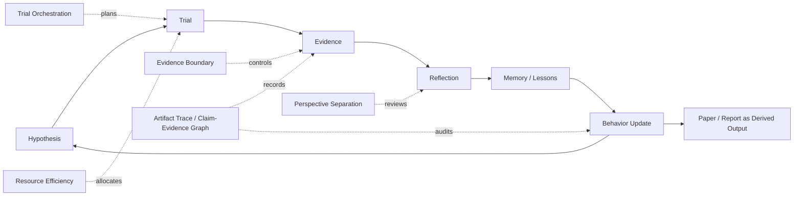

# Figure 1: Scientific Trial-and-Error Harness for Trial-to-Behavior Conversion

## 目的

用一张总览图展示全文核心 position：autonomous research 的关键不是从 idea 线性生成 paper，而是通过可控试错循环，把 trial history 转化为未来科研行为的改变。图中要保留 research intuition 的叙事张力，但把它操作化为可观察的 behavior update。

## 正文位置

Section 1 Introduction 末尾或 Section 4 Theory 开头。建议作为全文 visual anchor。

## 核心论证点

- 中心循环：Hypothesis -> Trial -> Evidence -> Reflection -> Behavior Update -> New Trial。
- Behavior Update 是本文的关键节点：它把感性的 research intuition 转换为系统可评价的 action policy change。
- 外圈 harness functions：Trial Orchestration、Evidence Boundary、Research Memory、Perspective Separation、Resource Efficiency。
- 底座：Artifact Trace / Claim-Evidence Graph。没有 trace，就无法证明系统真的从 trial 中改变行为。
- Paper/report 是 derived output，不是中心终点。
- Sibyl dual-loop Research OS 是该 harness 的具体实现方式。

## ASCII 草图

```text
       Scientific Trial-and-Error Harness

+---------------------------------------------------------------+
|                                                               |
|  Trial Orchestration          Perspective Separation           |
|  task plans, pilots           critic, methodologist, supervisor|
|                                                               |
|             +-----------------------------------+             |
|             |                                   |             |
|             v                                   |             |
|   [Hypothesis] -> [Trial] -> [Evidence] -> [Reflection]        |
|         ^                                         |            |
|         |                                         v            |
|   [New Trial] <- [Behavior Update] <- [Memory / Lessons]       |
|                    plan / experiment / claim / scheduler       |
|                    / validation / writing changes              |
|                                                               |
|  Evidence Boundary             Resource Efficiency             |
|  pilot/full gate               GPU scheduler, sanity checks    |
|  claim maturity                recovery, early stop            |
|                                                               |
|  Substrate: Artifact Trace + Claim-Evidence Graph              |
|  plans, configs, logs, results, reviews, claims, negative ev.  |
+---------------------------------------------------------------+

       Paper = expression of evidence state, not research itself
       Sibyl implementation = dual-loop Research OS
```

## 可选 Mermaid 草图



## 正式插图注意事项

- 不要画成传统 pipeline。必须是闭环，而且 behavior update 要清晰可见。
- 外圈五类 harness 不要堆太多文字，每类只放 2-3 个关键词。
- Paper 应画成 derived output，而不是中心终点。
- Negative results 应作为 evidence 的一类出现，不要画成失败垃圾。
- Sibyl dual-loop 只作为底部实现注释，避免抢走主概念。

## 图像生成提示词

```text
Create a clean academic systems-paper diagram titled "Scientific Trial-and-Error Harness". Center: a circular loop with six nodes labeled Hypothesis, Trial, Evidence, Reflection, Memory / Lessons, Behavior Update, then back to Hypothesis / New Trial. Make "Behavior Update" visually central and label examples: plan, experiment, claim, validation, scheduler, writing changes. Around the loop, draw five quiet outer modules: Trial Orchestration, Evidence Boundary, Research Memory, Perspective Separation, Resource Efficiency. Add a base layer labeled Artifact Trace + Claim-Evidence Graph with logs, results, reviews, claims, negative evidence. Add a small side note: "Paper = expression of evidence state" and bottom note: "Sibyl implementation: dual-loop Research OS". Style: NeurIPS paper figure, minimal, high contrast, vector-like, white background, no decorative gradients, no cartoon agents.
```
